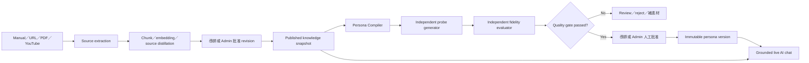

# Persona Compiler／導師角色蒸餾器

更新：2026-08-05

Persona Compiler 將 AIGRO 已批准知識轉成可版本化、可驗證、可回退的導師思考藍圖。方法參考 MIT licensed [Nuwa Skill](https://github.com/alchaincyf/nuwa-skill) 的跨來源研究、矛盾保留、誠實邊界與 fidelity evaluation，但不採用直接冒充真人、自動上網或未經授權蒐集素材的做法。

## 系統流程

## Persona blueprint

- `mental_models`：3–7 個可重現思考模型；每個至少引用兩個獨立 published revisions。
- `decision_heuristics`：情境、規則、取捨與 evidence refs。
- `expression_dna`：語氣、節奏、回答結構、常用模式與應避免表達。
- `values`／`anti_patterns`：從行為證據歸納的價值與反模式。
- `tensions`：保留表面矛盾，說明不同立場各自在甚麼條件成立。
- `honest_boundaries`：資料不足、私人經歷、保證結果等邊界及回應策略。
- `timeline`：保存有證據的觀點變化，不把不同時期壓成單一立場。

所有輸出 evidence refs 都由 worker 驗證；模型創作或引用不存在的 ref 會令整個 job retry／fail。

## 發佈 gate

1. Compiler 只讀 queue 當刻 snapshot 的 approved、published、未 archive revisions。
2. 新版本合成期間舊 persona 繼續服務。
3. Probe generator 以 blueprint 回答 verified questions；evaluator 使用 evidence manifest 獨立評分。
4. Gate：總分 ≥ 80、edge honesty ≥ 16/20、source transparency ≥ 12/15。
5. 通過模型 gate 後仍須導師或 Admin 人工批准；Admin 代批准寫入 audit trail。
6. 發佈時一次過建立 immutable `expert_persona_versions`，再原子切換 `published_persona_version_id`。
7. Rollback 使用舊 persona version；不可改寫歷史 blueprint、evidence manifest 或 fidelity report。

## Live chat 邊界

- Chat 必須自稱「授權 AI 導師／AI 分身」，被問身份時清楚說明不是真人本人。
- Persona blueprint 只提供思考框架和表達偏好，不可當作事實來源。
- 導師觀點、個人經歷和 citation 仍只可來自當次 published-only RAG chunks。
- Chat 不會自行上網補充導師立場；新資料必須先經 CMS ingestion、審批和重新 synthesis。
- Coverage 不足時標示 general／none，記錄 knowledge gap，並顯示真人導師預約入口。

## Operations

- Queue：`queue_persona_synthesis(expert_id)`；至少需要兩個已發佈來源。
- Worker：`persona-compiler`，最多 retry 三次，以 row lock／lease 防止重複執行。
- Review：`review_persona_synthesis(job_id, decision, notes)`。
- Publish：`publish_compiled_persona(job_id, greeting)`。
- Scheduler：database trigger 即時喚醒，pg_cron 每分鐘補救漏執行及 stuck jobs。
- Secrets：Edge Function 使用 `PERSONA_COMPILER_SECRET`；Vault 使用 `persona_compiler_secret`。

Public instructors 或第三方人物資料只有在具備授權、合理使用依據及來源審批時方可進入 CMS；Persona Compiler 本身不主動爬取外部人物資料。
